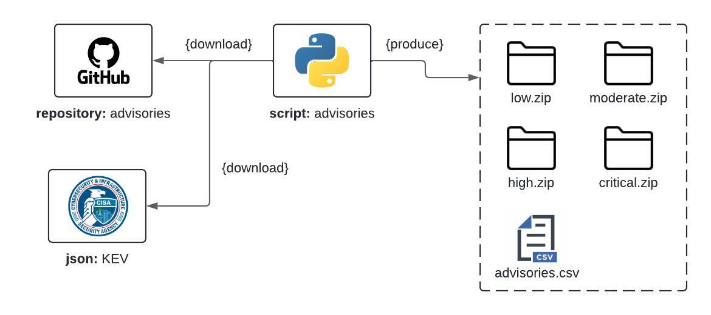

# Advisories

## Project Description

Advisories is a script that downloads all GitHub security vulnerabilities from the GitHub Advisory Database. It then zips up the advisories by severity, creating 4 zip files for each severity category: low, moderate, high, and critical.

## Installation

Follow these steps to install the project:

1. **Clone the repository**:
    ```bash
    git clone https://github.com/luismoralesp/advisories
    cd advisories
    ```

2. **Create and activate a virtual environment (optional but recommended)**:
    ```bash
    python -m venv venv
    source venv/bin/activate  # On Windows use `venv\Scripts\activate`
    ```

3. **Install the dependencies**:
    ```bash
    pip install -r requirements.txt
    ```

## Running the Tests

To run the project's tests, follow these steps:

1. **Ensure all dependencies are installed**:
    ```bash
    pip install -r requirements.txt
    ```

2. **Run the tests**:
    ```bash
    python -m unittest
    ```

## Python Version

This project has been tested with Python 3.12.3. Make sure you are using a compatible version of Python to avoid compatibility issues.

## Diagrams

### General Project Diagram



### Class Diagram


## How to Contribute

Contributions are welcome and appreciated. To contribute to the project:

1. **Fork** the repository.
2. Create a new **branch** for your feature or fix:
    ```bash
    git checkout -b feature/new-feature
    ```
3. Make your changes and ensure all tests pass.
4. **Commit** your changes:
    ```bash
    git commit -m "Add new feature"
    ```
5. **Push** to the branch:
    ```bash
    git push origin feature/new-feature
    ```
6. Create a **Pull Request** on GitHub.

Please make sure to follow the project's guidelines and maintain code consistency.

---

Thank you for contributing and for using RepoClonerHandler. We hope this tool is helpful to you!
